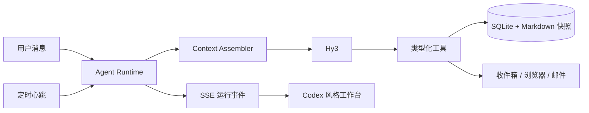

# Learning Agent · Hy3

一个在个人电脑上持续运行的主动式学习 Agent Harness。它不是只会聊天的问答框：用户对话和后台心跳进入同一套 Agent Runtime，Hy3 可以读取计划与分层上下文、调用原子工具、主动提醒或抽查，并把每次行动作为可审计事件实时展示。

当前版本聚焦编程与技术学习，只做个人本地部署或个人服务器部署，不建设多用户平台。

## 为什么是 Harness



- 同一个统一 Agent 处理对话、心跳、计划与考核，按任务切换角色。
- 界面展示上下文组装、行动摘要、工具调用、结果和失败，不展示模型私有思维链。
- 长期记忆只生成候选，用户确认后生效；低风险写操作留下逆向 Patch，可撤销。
- 后台提醒受免打扰、每日上限和冷却时间等确定性 Guard 约束。
- 原始对话、学习事件、分层记忆和每次 Run 的上下文快照分别保存。

工具不是预先写死的业务流程。它们是 Agent 的基础系统调用：Runtime 可以根据当前目标多轮读取状态、选择工具、观察返回、修正参数并继续，直到完成、失败、取消或达到预算。用户消息、后台心跳和复习事件不会进入三套 Prompt 流程，而是共享这一个执行内核。

## 工作台体验

- 主画布以连续 Session 为中心，多轮用户消息和 Agent 答复不会被最新 Run 覆盖；当前 Run 的上下文读取、工具动作和结果嵌在对应轮次中。
- 上下文组装、工具结果和状态变化以内联摘要呈现；完整参数与 JSON 放在可收起的运行抽屉中。
- 学习计划先以完整卡片列表呈现，点击后进入单一计划工作区；它不是独立的 CRUD 后台，而是 Agent 可观察、可操作的环境。
- 输入框始终标明“全局对话”或具体“计划焦点”。全局对话协调多个计划，计划对话只装配该计划的任务、事件、记忆、证据与复习状态。
- 长流程默认折叠为关键动作，用户可以展开全部步骤、停止运行或确认撤销操作。

## 已实现能力

- 完整 `Plan → Stage → Task` 计划模型与多计划工作台
- `AgentRun / RunEvent` 生命周期、SSE 实时轨迹和停止请求
- Session 原始消息恢复与多轮连续对话画布
- Hy3 多轮 Function Calling，以及 TokenHub 交错式思考字段回填
- 全局与计划级记忆、来源/置信度、确认/删除、Markdown 快照
- 长会话压缩、分层相关性检索、短期过期/情节归档和计划摘要维护
- 周期心跳和手动心跳，共用同一个 Agent Runtime
- 默认站内收件箱、浏览器通知、可选 SMTP 发送与 IMAP 回复
- 简答测验、证据化评分、复习调度、XP 与可撤销操作基础
- 核心任务证据门槛、真实计划进度和真实学习事件热力图
- 对话优先的响应式工作台、可收起运行抽屉、纵向计划时间线和轻游戏化视觉
- 31 个真实工具：资源搜索/核验、计划修改、提交验收、文件、代码、日历和记忆维护

当前代码执行是个人工作区内的有界进程，不是容器级安全沙箱。外部日历双向同步、崩溃检查点和真实子 Agent 仍属于后续硬化，不在界面中伪装成已完成能力。

## 快速开始

要求 Python 3.11+ 与 Node.js 20+。

```bash
./scripts/setup.sh
cp .env.example .env
```

只在本机 `.env` 中填写 TokenHub Key：

```dotenv
OPENAI_API_KEY=你的密钥
OPENAI_API_BASE=https://tokenhub.tencentmaas.com/v1
MODEL_NAME=hy3
```

密钥不得提交到 Git。启动后端；它会同时托管已构建的前端：

```bash
./scripts/start.sh
```

打开 <http://127.0.0.1:8000>。开发前端时可另开终端：

```bash
cd frontend
npm run dev
```

Vite 会把 `/api` 代理到 `127.0.0.1:8000`。

## 两条演示流程

### 1. 完整计划与主动提醒

在底部输入目标、基础、截止日期、每周时间、偏好、期望产出、资源和不采用的方法，请 Agent 创建完整计划。随后点击“立即运行一次心跳”：Hy3 会读取计划和近期事件，自主选择保持安静、提醒、抽查或执行低风险可撤销调整。

### 2. 核心任务与主动考核

让 Agent 把一个核心任务标记为完成。没有证据时工具会拒绝；提交答案或仓库/文件证据后，Agent 可以创建并评分测验、更新 XP、安排复习。工具结果和操作 ID 出现在按需打开的运行抽屉中。

## 验证

```bash
source .venv/bin/activate
pytest -q
npm --prefix frontend run build
npm --prefix frontend audit --omit=dev
```

自动化测试使用隔离数据库和模拟模型响应，验证工具循环但不冒充真实 Hy3 调用。当前已经额外完成真实 TokenHub Hy3 的多轮工具调用验收；平台偶发错误仍会被记录为 `run.failed`，不会在界面中伪装成功。

## 数据与安全

- SQLite 默认位于 `data/learning_companion.db`，上下文快照位于 `data/context/`，两者都被 Git 忽略。
- Agent 文件工作区位于 `data/workspace/`；文件工具拒绝路径穿越。
- SMTP 密码和 TokenHub Key 只保存在 `.env`。
- 浏览器通知只有在用户授予权限后显示。
- 本地服务或电脑停止时无法主动提醒。
- 代码执行有工作目录、环境、时间与输出上限，但不应运行来源不可信的代码。

## 项目文档

- [产品定义](docs/PRODUCT.md)
- [架构与上下文](docs/ARCHITECTURE.md)
- [Harness 完整性标准](docs/HARNESS.md)
- [工具与权限协议](docs/TOOL_PROTOCOL.md)
- [路线图](docs/ROADMAP.md)
- [当前状态](docs/STATUS.md)
- [参赛提交清单](docs/SUBMISSION.md)
- [完整 Demo 脚本](docs/DEMO.md)

## License

[MIT](LICENSE)
