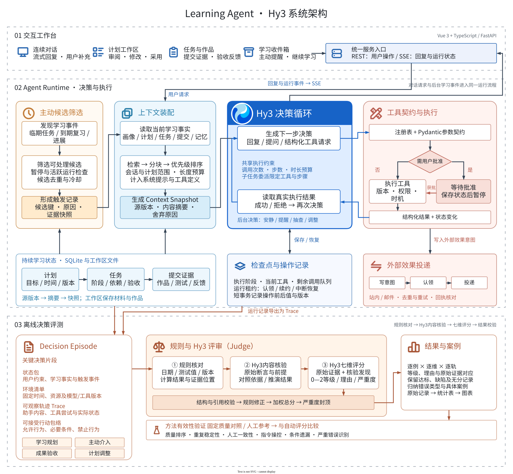
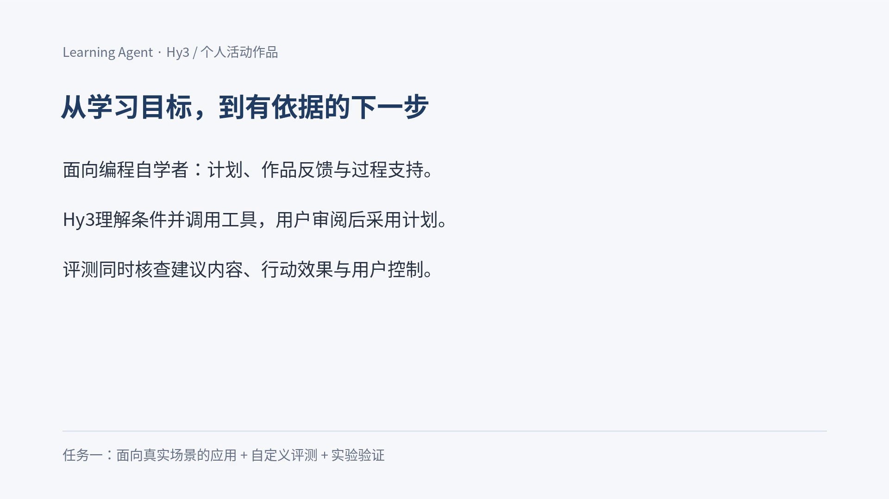

# Learning Agent · Hy3

> 本项目为2026腾讯犀牛鸟开源人才培养计划混元实战任务一的个人活动作品。

### 一个持续理解学习状态、主动判断并推动目标完成的个人学习 Agent

[项目与评测报告](第三阶段项目与评测报告.md) · [第三阶段交付总览](第三阶段交付说明.md) · [108秒Demo](assets/demo/stage3/learning-agent-stage3.mp4) · [演示页（已发布版本）](https://zmuxuny.github.io/hy3-learning-agent/)

评测材料已补充[新场景严重失败验证](evaluation/artifacts/decisionbench-severe-validation-20260910/README.md)和[双人人工确认](evaluation/artifacts/human-confirmation-20260910/README.md)：新增72次评分中，严重36/36识别、正常36/36通过。

Learning Agent · Hy3 面向编程与技术学习，把 AI 从一次性问答扩展为贯穿目标、计划、执行、验收与调整的持续学习伙伴。

用户可以从一句并不完整的目标开始，例如：“我有 C++ 基础，希望两个月内学会 CUDA，并完成一个矩阵乘优化项目。”Hy3 会澄清真正影响路径的条件、调研并核验资源、提出可审阅的计划；当学习开始后，它继续跟踪任务与证据、验收成果，并根据新的学习事实选择保持安静、教学、抽查、提醒或调整计划。

> **让 AI 从一次性回答走向持续行动：理解目标、跟踪进度、验证掌握，并在恰当的时机主动介入。**



## 核心体验

| 能力 | Hy3的处理方式 | 用户可见结果 |
| --- | --- | --- |
| 目标澄清与规划 | 围绕基础、期限、时间预算和期望作品提出高信息量问题，生成可讨论、可修改、可采用的计划提案 | 从模糊愿望走向一条真正可执行的学习路径 |
| 资源调研与教学 | 搜索、打开并核验课程与资料，结合当前任务提供讲解和练习 | 资源与目标、难度和阶段相匹配 |
| 学习成果验收 | 依据任务 Rubric 检查回答、代码、文件和项目作品，记录结论、证据与反馈 | “完成任务”建立在可查看的学习证据上 |
| 主动介入 | 综合截止时间、近期活动、复习安排、历史提醒和用户偏好决定 `WAIT` 或行动 | 需要帮助时得到具体支持，不需要时保持安静 |
| 计划调整 | 在进度、能力或现实条件变化后提出范围合适的修改，并保留用户确认边界 | 计划随真实学习过程持续演进 |
| 连续上下文 | 分层维护对话、计划、任务、事件、证据、记忆和运行轨迹 | 每一次决策都基于可追溯的最新状态 |

## 主动学习闭环

Learning Agent 不把计划视为静态日程，也不把一次对话当作任务终点。系统围绕六个阶段持续运行：

```text
目标与约束 → 规划与资源 → 学习与提交 → 成果验收
     ↑                                  ↓
主动判断 ← 提醒 / 抽查 / 调整 ← 学习状态与证据
```

用户消息、后台心跳、任务事件与复习到期进入同一个 Agent Runtime。Hy3 读取与当前目标相关的上下文，选择工具、观察结果并继续决策；确定性的权限、频率、冷却、免打扰和审批规则负责守住行动边界。

这里的“主动”不以通知数量衡量。`WAIT` 是与提醒、抽查和调整同等重要的决策：系统追求的是一次有依据、及时、可执行的介入。

## 系统设计

整体系统由五部分组成：

- **交互工作台**：连续对话、计划工作区、学习任务与收件箱共同呈现目标、过程和下一步。
- **Hy3 Agent Runtime**：统一处理用户请求与后台主动任务，通过多轮工具调用完成真实操作。
- **学习能力层**：覆盖规划、资源调研、教学、成果验收、复习、提醒与计划调整。
- **学习事实层**：持久化画像、计划、任务、证据、事件、记忆和可审计操作，为后续决策提供连续状态。
- **离线评测平面**：从关键决策导出可回放样本，在隔离环境中完成评分、有效性验证和结果归因，不进入用户运行时。

架构图提供 [draw.io 可编辑源文件](assets/proposal/architecture/learning-agent-system-architecture.drawio) 与 [PNG 版本](assets/proposal/architecture/learning-agent-system-architecture.png)。

## 第三阶段产出

第三阶段同时交付学习助手应用、场景化评测及有效性实验。评测输入覆盖学习规划、主动介入、成果验收和计划调整，读取用户要求、完整助手内容、工具结果与状态变化，评价事实、目标、时机、约束、可用性、适度性与解释。

以下文档均位于仓库根目录。报告正文说明应用与方法，附录完整列出评测集；数据和结果链接可进一步核对每一项证据。

| 产出 | 文件与内容 |
| --- | --- |
| 项目与评测分析报告 | [第三阶段项目与评测报告.md](第三阶段项目与评测报告.md) · [PDF](第三阶段项目与评测报告.pdf) · [HTML](第三阶段项目与评测报告.html)：用户场景、应用实现、方法、具体用例、实验与典型发现 |
| 评估方法说明 | [学习决策评测方法.md](学习决策评测方法.md)：评价对象、七维判据、权重、核验、评分及复核流程 |
| 完整评测集目录 | [评测用例目录.md](评测用例目录.md)：116份输入材料的具体条件、构造差异、难度和逐项文件链接 |
| 任务书交付索引 | [第三阶段交付说明.md](第三阶段交付说明.md)：五类产出、完整结果表和复现入口 |
| 样本与评测脚本 | [DecisionBench数据集](evaluation/datasets/decisionbench-learning-v1/README.md) · [评测运行说明](evaluation/README.md)：48个应用输入、24份三档输出、8份操纵输出、24份正常与严重对照及12份条件对照 |
| 实验结果与数据 | [统一方法实验](evaluation/artifacts/decisionbench-final-method-20260910/README.md) · [条件验证](evaluation/artifacts/condition-validation-20260910/README.md) · [卷积案例分析](evaluation/artifacts/condition-insight-20260910/README.md) · [人工标注对齐](evaluation/artifacts/human-confirmation-20260910/README.md)：全部请求、响应、逐例结果与复算 |
| 产品与评测Demo | [108秒视频](assets/demo/stage3/learning-agent-stage3.mp4)：目标输入、计划审阅及采用、典型证据与评测验证 |

主体实验包含200个评分位置：48份真实应用输出、24份三档输出、8份操纵输出、24份正常与严重对照。三档严格排序23/24组，重复加权分标准差均值3.70，操纵误通过1/8；应用人工参考46通过、2未通过。正常与严重对照中，严重36/36识别且未通过、正常36/36通过。另有12份条件材料各评3次，以及卷积案例的固定依据诊断。各项分母、原始响应和逐项复核均随结果表提供。

## Demo

[](assets/demo/stage3/learning-agent-stage3.mp4)

[观看108秒Demo（1080p）](assets/demo/stage3/learning-agent-stage3.mp4) · [素材与复建](assets/demo/stage3/README.md)

视频同时展示真实目标输入、提案验收细则、用户采用和计划工作区，以及完整决策证据、典型内容问题、三档判别和重复一致性结果。浏览器保持完整视口，字幕位于画面外边距；模型与网络等待已剪去。


## 快速开始

源码运行需要 Python 3.11+ 与 Node.js 20+。

```bash
git clone https://github.com/zmuxuny/hy3-learning-agent.git
cd hy3-learning-agent
./scripts/setup.sh
cp .env.example .env
./scripts/start.sh
```

打开 <http://127.0.0.1:8000>，首次设置向导会验证模型连接并创建第一条会话。也可以提前在 `.env` 中配置：

```dotenv
OPENAI_API_KEY=你的密钥
OPENAI_API_BASE=https://tokenhub.tencentmaas.com/v1
MODEL_NAME=hy3
```

开发前端时运行：

```bash
cd frontend
npm run dev
```

## 验证

```bash
source .venv/bin/activate
pytest -q
result_output=$(mktemp -d /tmp/learning-agent-results-XXXXXX)
PYTHONPATH=evaluation/src:backend python evaluation/scripts/summarize_final_method.py \
  --archive evaluation/artifacts/decisionbench-final-method-20260910 --output "$result_output/automatic"
diff -r evaluation/artifacts/decisionbench-final-method-20260910/automatic "$result_output/automatic"
npm --prefix frontend test
npm --prefix frontend run build
python scripts/check_doc_links.py .
python scripts/release-gate.py --repository . --format json
```

测试覆盖持久化迁移、事务与副作用、Runtime 恢复、学习证据、上下文与记忆、主动介入、安全边界、前端状态对账、响应式浏览器路径和首次设置。详细结果与复现入口见[第三阶段交付说明](第三阶段交付说明.md)。

## 数据与安全

- 默认 `local` 模式只监听本机回环地址；个人服务器部署需要认证令牌、精确 HTTPS Origin 与一致的 CORS 配置，详见[安全与部署边界](SECURITY.md)。
- SQLite、上下文快照、工作区文件和备份位于本地 `data/`，不会进入 Git。
- 长期记忆保留来源与生命周期，用户可以确认、纠正、归档和恢复。
- 外部内容始终作为不可信输入处理；没有可信沙箱 Provider 时，代码执行能力不会开放。
- 低风险数据库操作保留审计与撤销信息，外部发送通过耐久 Outbox 记录意图和结果。

## 产品与技术文档

- [产品功能与使用边界](docs/PRODUCT.md)
- [系统架构与数据流](docs/ARCHITECTURE.md)
- [工具与权限协议](docs/TOOL_PROTOCOL.md)
- [邮件渠道配置](docs/EMAIL.md)
- [安全与部署说明](SECURITY.md)
- [已提交的第三阶段项目方案](腾讯犀牛鸟开源实习第三阶段项目方案.md)

## License

[MIT](LICENSE)
