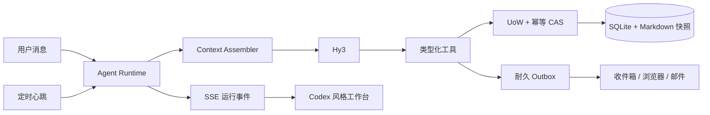

# Learning Agent · Hy3

一个在个人电脑上持续运行的主动式学习 Agent Harness。它不是只会聊天的问答框：用户对话和后台心跳进入同一套 Agent Runtime，Hy3 可以读取计划与分层上下文、调用原子工具、主动提醒或抽查，并把每次行动作为可审计事件实时展示。

当前版本聚焦编程与技术学习，只做个人本地部署或个人服务器部署，不建设多用户平台。

> 安全与开发状态：`develop` 已完成 H1–H7，累计关闭 83 个缺陷 ID，矩阵剩余 4 个 open ID，下一门禁是 H8。默认 `local` 模式只接受 loopback；高级 `server` 模式在缺少认证或精确 HTTPS Origin 时拒绝启动。仓库不提供真实代码沙箱，因此 `code_execute` 默认不可用。M15–M20 继续冻结，H8 与真人验收完成前仍不具备 V2 Alpha 发布条件。详见[安全边界](SECURITY.md)和[前置硬化计划](docs/V2_HARDENING_PLAN.md)。

## Demo

[](https://zmuxuny.github.io/hy3-learning-agent/)

[▶ 在线播放完整 Demo（92.6 秒 · 1080p）](https://zmuxuny.github.io/hy3-learning-agent/)

同一段视频包含两条真实端到端流程：

1. 模糊目标 → 结构化澄清 → 规划调研 → 可审阅提案 → 用户采用 → 带交接摘要的计划 Session；
2. 读取真实进度 → 当前任务教学 → 文件与代码检查 → 证据验收 → 进度更新 → 心跳自主提醒。

视频中的模型决策均来自 TokenHub Hy3 API，工具调用、计划进度、验收结果和站内通知均为真实运行状态；剪辑仅移除了模型与网络等待时间。

## 为什么是 Harness



- 同一个统一 Agent 处理对话、心跳、计划与考核，按任务切换角色。
- 界面展示上下文组装、行动摘要、工具调用、结果和失败，不展示模型私有思维链。
- 长期记忆只生成候选，用户确认后生效；低风险写操作留下逆向 Patch，可撤销。
- 后台提醒受免打扰、每日上限和冷却时间等确定性 Guard 约束。
- 原始对话、学习事件、分层记忆和每次 Run 的上下文快照分别保存。

工具不是预先写死的业务流程。它们是 Agent 的基础系统调用：Runtime 可以根据当前目标多轮读取状态、选择工具、观察返回、修正参数并继续，直到完成、失败、取消或达到预算。用户消息、后台心跳和复习事件不会进入三套 Prompt 流程，而是共享这一个执行内核。

## 工作台体验

- 主画布与侧栏都以连续 Session 为中心，多轮用户消息和 Agent 答复不会被最新 Run 冒充为多个对话；首轮完成后生成语义标题，用户可以手动改名。
- 每轮 Agent 工作以内联 `已处理/处理中` 记录呈现；整轮可折叠，每个工具操作也能单独展开结构化输入与结果。子 Agent 标签归入所属 Run，展开后可复盘调查任务、搜索词、读取来源、工具结果和最终报告。
- 学习计划先以完整卡片列表呈现，点击后进入单一计划工作区；它不是独立的 CRUD 后台，而是 Agent 可观察、可操作的环境。
- 输入框始终标明“综合学习上下文”或具体计划名称。综合对话协调多个计划，计划对话只装配该计划的任务、事件、记忆、证据与复习状态。
- 长流程默认折叠为关键动作，用户可以展开全部步骤、即时停止实际执行协程，或在原位置处理阻塞审批。

## 已实现的正常路径候选

以下条目说明当前能力范围。H1–H7 已分别验收迁移、事务、Runtime、Evidence、长期 Context/提醒线程、应用安全边界与前端最小闭环；当前只剩 H8 首启、发布和真人门禁：

- 完整 `Plan → Stage → Task` 计划模型与多计划工作台
- `AgentRun / RunEvent` 生命周期、SSE 实时轨迹和停止请求
- Run 检查点、审批暂停/恢复、Queue successor、finalization、重试与父子投影均由统一 lease/state machine 强制并通过 H3 故障恢复门禁
- 48 个已安装工具契约按 `pure_read / database_write / external_read / external_write` 分类；默认模型 surface 为 47 个，缺少真实 sandbox Provider 时不会暴露 `code_execute`
- Session 列表、原始消息恢复、语义命名、手动改名与多轮连续对话画布
- Session/计划手动归档与恢复、归档列表，以及全局对话到计划对话的可追溯交接
- 持久化计划共创：需求充分性判断、结构化提问卡、受限规划子 Agent、可审阅提案与显式采用
- 用户消息复制与非破坏式编辑；旧版本、旧 Run 和工具操作保留，当前 Session 从修订处重新运行
- Hy3 多轮 Function Calling，以及 TokenHub 交错式思考字段回填
- 全局/计划/Session 分层记忆、版本化来源、候选确认、纠正替代链、归档/恢复与可重建 Markdown 投影；跨计划隔离、expiry 与来源失效已通过 H5
- 长会话压缩、摘要版本、连续 coverage、完整 PromptEnvelope 预算、相关性阈值/层级配额与编辑来源闭包已通过 H5
- Run 内联上下文检查器：实际来源构成、命中记忆分数、Token 估算和送入模型的 Markdown
- 单实例全局心跳、ProactiveDecision、唯一 Intervention/canonical message、活动 Run reply target、多渠道 delivery 与 IMAP durable ack 已通过 H5
- 收件箱显示上次判断、下次检查与当前状态，并支持消息归档、恢复和批量归档已读；归档不删除对话中的提醒
- 默认站内收件箱、Service Worker 浏览器通知、可选 VAPID Web Push、可选 SMTP 发送与 IMAP 回复；外部发送先提交 outbox intent，进程在 provider 响应前后中断时会进入人工/provider 对账而不是盲目重发
- 简答测验、证据化评分、复习调度、XP 与可撤销操作基础
- 核心任务证据门槛、真实计划进度和真实学习事件热力图
- 对话优先的响应式工作台、消息内可收起工作记录、纵向计划时间线，以及热力图、连续天数、XP/等级和规则成就数据等轻游戏化基础
- 正式深链路由与 session/run/plan/inbox/memory/settings 分域状态；核心首屏和可降级请求独立提交，提醒 target、SSE 断线对账、计划归档焦点和实时 steer 顺序均有浏览器/组件回归
- 计划详情提供只读技能—训练/证明—Evidence 解释；375/768/1280/1440/2560 五种首次导航尺寸已用公开合成临时库完成真实 Chrome 验收
- “设置”页提供模型连接、SMTP/IMAP 与主动策略；`.env` 更新会预校验全部字段、拒绝控制字符/非普通文件，并以 0600 原子发布且复杂值可无损往返
- 48 个已安装工具契约：需求澄清、规划分工与提案、通用只读子 Agent、学习位置快照、课程资源搜索/核验/策展、计划修改、提交验收、复习处置、文件、代码、日历、记忆维护和显式技能图映射；当前模型 surface 为 47 个，`code_execute` 因无可信 sandbox Provider 而不可用
- Web 搜索主源失败时自动降级到 Bing HTML 备选源；每跳固定公有 IP 并复核 peer，wire/解压大小、总时间和精确 MIME 均受限，所有结果标记为外部不可信

当前构建没有 capability-attested sandbox Provider，`code_execute` 在模型、直接调用和旧 outbox 恢复边界均失败关闭。仓库内保留的有界宿主 runner 只是内部兼容原语，不是可启用的安全沙箱。

## 快速开始

要求 Python 3.11+ 与 Node.js 20+。

```bash
./scripts/setup.sh
cp .env.example .env
```

只在本机 `.env` 中填写 TokenHub Key：

```dotenv
OPENAI_API_KEY=你的密钥
OPENAI_API_BASE=https://tokenhub.tencentmaas.com/v1
MODEL_NAME=hy3
```

密钥不得提交到 Git。启动后端；它会同时托管已构建的前端：

```bash
./scripts/start.sh
```

打开 <http://127.0.0.1:8000>。开发前端时可另开终端：

```bash
cd frontend
npm run dev
```

Vite 会把 `/api` 代理到 `127.0.0.1:8000`。

如需高级个人服务器模式，先完整阅读 [SECURITY.md](SECURITY.md)。必须设置 `DEPLOYMENT_MODE=server`、至少 32 字节的 `SERVER_AUTH_TOKEN`、精确 `https://` 的 `SERVER_PUBLIC_ORIGIN`，并令 `CORS_ORIGINS` 与之完全一致；缺少任一项都会失败关闭。浏览器登录与安装产品化仍属于 H8，不能把本机模式经端口转发直接暴露到公网。

站内提醒完全不需要邮箱：应用运行时，前端每 15 秒同步后台通知并在页面内弹出新提醒。只有希望离开应用后仍收到邮件或直接回复邮件时，才需要在 `.env` 配置 SMTP/IMAP 凭据；独立 Agent 邮箱是推荐方案而不是硬性要求，完整选择、字段和测试方法见 [邮箱配置](docs/EMAIL.md)。

## 验证

```bash
source .venv/bin/activate
pytest -q
npm --prefix frontend test
npm --prefix frontend run build
npm --prefix frontend audit --omit=dev
python scripts/check_doc_links.py .
```

本地数据管理：

```bash
./scripts/reset-data.sh
./scripts/seed-fixture.sh
./scripts/demo-data.sh reset
./scripts/demo-data.sh restore <backup-directory>
python3 scripts/data-maintenance.py preflight
python3 scripts/data-maintenance.py backup --purpose manual
```

H1 已把维护协议收敛到 `preflight / backup / verify / restore / recover` 与显式 migration backup verify/restore。它们使用受控 lifecycle lease 和验证过的备份发布流程；但仍不支持绕过 Runtime/maintenance 直接写 SQLite 的外部进程。

H2 已把数据库写入收敛到统一 UoW，并在最外层 SQLite savepoint 前显式开启 physical outer transaction，防止释放最外层 savepoint 时提前提交。数据库变更、幂等状态和 outbox intent 在同一事务落盘；`file_write` 可凭已持久化 hash 自动判断是否安全复用，SMTP、Web Push 和外部 subprocess 的不确定结果则必须人工或向 provider 对账。旧 schema 数据默认 fail-closed，不能假装已经具备 H2 语义。

迁移和恢复会在交接边界复核固定的路径、目录描述符/inode 与内容摘要，只把复验通过的候选库、备份 payload 或工作快照作为 trusted snapshot；目标数据库或安全备份根目录若指向 source backup 本身或其子路径，会在写入前失败关闭。source backup 位于安全备份根目录下仍是正常布局。共享路径规范化会消除 `.`/`..` 别名而不跟随 symlink，并正确编码含空格、`%`、`#`、`?` 的 SQLite 路径。旧 `_write_probe` 也只按精确的空单列表识别，近似或被污染的同名 schema 不会被静默接受。

V2 学习证据账本、完整 reducer 和 Artifact/Competency 关联已通过 H4。H1 回归证明 `rebuild-evidence --audit` 逐字节只读，任何回填/重建写操作都会先取得协调 lease 并完成全量验证备份；首次真实用户大规模回填、外部安装、连续学习闭环与 7 日留存仍待后续门禁和真人样本，因此以下写命令仍建议先在显式副本或临时根目录验证：

```bash
./.venv/bin/python scripts/rebuild-evidence.py --audit
./.venv/bin/python scripts/rebuild-evidence.py --backfill-v1 --audit --write
PYTHONPATH=backend ./.venv/bin/python scripts/evidence-baseline.py
```

自动化测试使用临时数据库和模拟模型响应，不冒充真实 Hy3 调用。历史 TokenHub/搜索/页面验证只证明当时的正常路径；当前事实以缺陷矩阵逐项状态、仍保留的 strict xfail 和各门禁修复后的 passing 回归为准，不能用历史场景数、截图数或构建通过替代领域验收。

各门禁的完整命令、精确测试数量和历史快照只在[当前状态](docs/STATUS.md)维护。自动化安全测试使用合成凭据、临时数据库、mock DNS/HTTP 和假 provider，不调用真实 SMTP/IMAP、公网或模型，也不替代 H8 的外部安装、连续使用和 7 日真人留存记录。

## 数据与安全

- SQLite 默认位于 `data/learning_companion.db`，上下文快照位于 `data/context/`，两者都被 Git 忽略。
- Agent 文件工作区位于 `data/workspace/`；文件工具拒绝路径穿越。
- SMTP/IMAP、TokenHub、server auth 与 VAPID 凭据来自本地 `.env`；事件、Context、checkpoint、日志和诊断错误统一脱敏，含配置凭据或脱敏占位符的工具参数在耐久 claim 前拒绝。仍不要把真实秘密放入对话、Artifact 或 Issue。
- 浏览器通知只有在用户授予权限后显示；VAPID Web Push 需要在 `.env` 配置密钥，电脑关机或浏览器完全退出时无法唤醒。
- 本地服务或电脑停止时无法主动提醒。
- 当前没有真实 sandbox Provider，代码执行能力保持关闭；不要通过内部 runner 绕过该边界。

## 项目文档

- 分支约定：`develop` 集成并完成发布验收，稳定版本合并到 `main` 后从 `main` 创建标签与 GitHub Release。

- [产品定义](docs/PRODUCT.md)
- [架构与上下文](docs/ARCHITECTURE.md)
- [Harness 完整性标准](docs/HARNESS.md)
- [工具与权限协议](docs/TOOL_PROTOCOL.md)
- [安全与部署边界](SECURITY.md)
- [邮箱配置与收发](docs/EMAIL.md)
- [路线图](docs/ROADMAP.md)
- [Learning Agent 2.0 路线图](docs/V2_ROADMAP.md)
- [V2 前置硬化实施计划](docs/V2_HARDENING_PLAN.md)
- [V2 H0 缺陷—测试—门禁矩阵](docs/V2_H0_DEFECT_MATRIX.md)
- [当前状态](docs/STATUS.md)

## License

[MIT](LICENSE)
