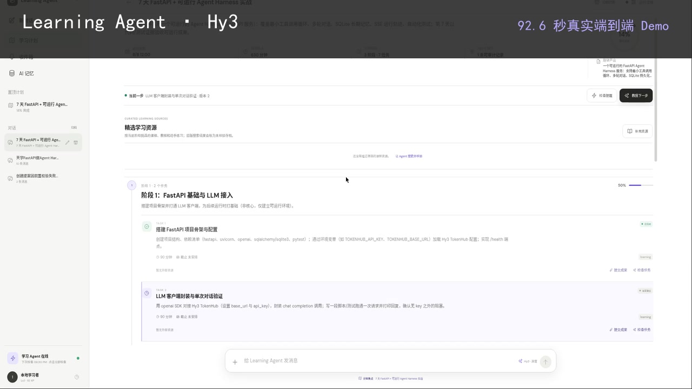
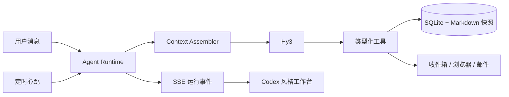

# Learning Agent · Hy3

一个在个人电脑上持续运行的主动式学习 Agent Harness。它不是只会聊天的问答框：用户对话和后台心跳进入同一套 Agent Runtime，Hy3 可以读取计划与分层上下文、调用原子工具、主动提醒或抽查，并把每次行动作为可审计事件实时展示。

当前版本聚焦编程与技术学习，只做个人本地部署或个人服务器部署，不建设多用户平台。

> 安全与开发状态：当前稳定版本只建议绑定 `127.0.0.1` 在本机使用；尚未提供服务器认证，也不能把有界 `code_execute` 当作安全沙箱。`develop` 的 V2 M13/M14 正在执行[前置硬化计划](docs/V2_HARDENING_PLAN.md)，[H0 缺陷矩阵](docs/V2_H0_DEFECT_MATRIX.md)中的生产缺陷仍全部 open，尚不具备 V2 Alpha 发布条件。

## Demo

[](https://zmuxuny.github.io/hy3-learning-agent/)

[▶ 在线播放完整 Demo（92.6 秒 · 1080p）](https://zmuxuny.github.io/hy3-learning-agent/)

同一段视频包含两条真实端到端流程：

1. 模糊目标 → 结构化澄清 → 规划调研 → 可审阅提案 → 用户采用 → 带交接摘要的计划 Session；
2. 读取真实进度 → 当前任务教学 → 文件与代码检查 → 证据验收 → 进度更新 → 心跳自主提醒。

视频中的模型决策均来自 TokenHub Hy3 API，工具调用、计划进度、验收结果和站内通知均为真实运行状态；剪辑仅移除了模型与网络等待时间。

## 为什么是 Harness



- 同一个统一 Agent 处理对话、心跳、计划与考核，按任务切换角色。
- 界面展示上下文组装、行动摘要、工具调用、结果和失败，不展示模型私有思维链。
- 长期记忆只生成候选，用户确认后生效；低风险写操作留下逆向 Patch，可撤销。
- 后台提醒受免打扰、每日上限和冷却时间等确定性 Guard 约束。
- 原始对话、学习事件、分层记忆和每次 Run 的上下文快照分别保存。

工具不是预先写死的业务流程。它们是 Agent 的基础系统调用：Runtime 可以根据当前目标多轮读取状态、选择工具、观察返回、修正参数并继续，直到完成、失败、取消或达到预算。用户消息、后台心跳和复习事件不会进入三套 Prompt 流程，而是共享这一个执行内核。

## 工作台体验

- 主画布与侧栏都以连续 Session 为中心，多轮用户消息和 Agent 答复不会被最新 Run 冒充为多个对话；首轮完成后生成语义标题，用户可以手动改名。
- 每轮 Agent 工作以内联 `已处理/处理中` 记录呈现；整轮可折叠，每个工具操作也能单独展开结构化输入与结果。子 Agent 标签归入所属 Run，展开后可复盘调查任务、搜索词、读取来源、工具结果和最终报告。
- 学习计划先以完整卡片列表呈现，点击后进入单一计划工作区；它不是独立的 CRUD 后台，而是 Agent 可观察、可操作的环境。
- 输入框始终标明“综合学习上下文”或具体计划名称。综合对话协调多个计划，计划对话只装配该计划的任务、事件、记忆、证据与复习状态。
- 长流程默认折叠为关键动作，用户可以展开全部步骤、即时停止实际执行协程，或在原位置处理阻塞审批。

## 已实现的正常路径候选

以下条目说明界面或代码路径已经存在，不代表崩溃恢复、并发、迁移、长期 Context 和安全不变量已经验收：

- 完整 `Plan → Stage → Task` 计划模型与多计划工作台
- `AgentRun / RunEvent` 生命周期、SSE 实时轨迹和停止请求
- Run 检查点与审批暂停/恢复候选；拒绝重启、current tool、queued/no-checkpoint、二次中断和 finalization 仍由 H3-RUN-001–007 阻塞
- 写工具幂等和 Run 预算候选；同 key 异内容冲突、统一 UoW、外部副作用 outbox 与 child 预算仍由 H2/H3 阻塞
- Session 列表、原始消息恢复、语义命名、手动改名与多轮连续对话画布
- Session/计划手动归档与恢复、归档列表，以及全局对话到计划对话的可追溯交接
- 持久化计划共创：需求充分性判断、结构化提问卡、受限规划子 Agent、可审阅提案与显式采用
- 用户消息复制与非破坏式编辑；旧版本、旧 Run 和工具操作保留，当前 Session 从修订处重新运行
- Hy3 多轮 Function Calling，以及 TokenHub 交错式思考字段回填
- 全局/计划/Session 分层记忆、来源/置信度、候选确认、纠正替代链、归档和 Markdown 快照候选；跨计划隔离与恢复 expiry 未验收
- 长会话压缩、摘要版本和混合检索候选；coverage、预算、阈值/层级配额和编辑失效仍由 H5-CTX 阻塞
- Run 内联上下文检查器：实际来源构成、命中记忆分数、Token 估算和送入模型的 Markdown
- 单实例全局心跳、提醒 Session/收件箱投影和回复候选；活动 Run target、多渠道事实、IMAP ack 与冷却语义仍由 H5 阻塞
- 收件箱显示上次判断、下次检查与当前状态，并支持消息归档、恢复和批量归档已读；归档不删除对话中的提醒
- 默认站内收件箱、Service Worker 浏览器通知、可选 VAPID Web Push、可选 SMTP 发送与 IMAP 回复
- 简答测验、证据化评分、复习调度、XP 与可撤销操作基础
- 核心任务证据门槛、真实计划进度和真实学习事件热力图
- 对话优先的响应式工作台、消息内可收起工作记录、纵向计划时间线，以及热力图、连续天数、XP/等级和规则成就数据等轻游戏化基础
- “设置”页候选：模型连接、SMTP/IMAP 与主动策略；`.env` 控制字符、原子临时文件和复杂值往返仍由 H6-CONFIG-001 阻塞
- 48 个真实工具：需求澄清、规划分工与提案、通用只读子 Agent、学习位置快照、课程资源搜索/核验/策展、计划修改、提交验收、复习处置、文件、代码、日历、记忆维护和显式技能图映射
- Web 搜索主源失败时自动降级到 Bing HTML 备选源，结果带 `fallback_used` 标记

当前代码执行是宿主上的有界进程，不是容器级安全沙箱；H6-CODE-001 修复前不得运行不可信代码。子 Run、SQLite 写竞争和恢复只有正常路径候选，H2-TXN-009 与 H3-RUN-008–011 已建立失败基线。

## 快速开始

要求 Python 3.11+ 与 Node.js 20+。

```bash
./scripts/setup.sh
cp .env.example .env
```

只在本机 `.env` 中填写 TokenHub Key：

```dotenv
OPENAI_API_KEY=你的密钥
OPENAI_API_BASE=https://tokenhub.tencentmaas.com/v1
MODEL_NAME=hy3
```

密钥不得提交到 Git。启动后端；它会同时托管已构建的前端：

```bash
./scripts/start.sh
```

打开 <http://127.0.0.1:8000>。开发前端时可另开终端：

```bash
cd frontend
npm run dev
```

Vite 会把 `/api` 代理到 `127.0.0.1:8000`。

站内提醒完全不需要邮箱：应用运行时，前端每 15 秒同步后台通知并在页面内弹出新提醒。只有希望离开应用后仍收到邮件或直接回复邮件时，才需要在 `.env` 配置 SMTP/IMAP 凭据；独立 Agent 邮箱是推荐方案而不是硬性要求，完整选择、字段和测试方法见 [邮箱配置](docs/EMAIL.md)。

## 验证

```bash
source .venv/bin/activate
pytest -q
npm --prefix frontend run build
npm --prefix frontend audit --omit=dev
```

本地数据管理：

```bash
./scripts/reset-data.sh      # legacy unsafe：H1 修复前禁止对正式数据使用
./scripts/seed-fixture.sh    # legacy unsafe：H1 修复前禁止对正式数据使用
./scripts/demo-data.sh       # legacy unsafe：H1 修复前禁止对正式数据使用
```

V2 的学习证据脚本目前是实现候选。H1-AUDIT-001 已证明 `--audit` 会在备份前触发 schema 写入；H1 完成前只允许对显式临时副本运行，禁止对正式数据库执行下列命令：

```bash
./.venv/bin/python scripts/rebuild-evidence.py --audit
./.venv/bin/python scripts/rebuild-evidence.py --backfill-v1 --audit --write
PYTHONPATH=backend ./.venv/bin/python scripts/evidence-baseline.py
```

自动化测试使用临时数据库和模拟模型响应，不冒充真实 Hy3 调用。历史 TokenHub/搜索/页面验证只证明当时的正常路径；当前 H0 strict-xfail 才是已知失败事实，不能用历史场景数、截图数或构建通过替代领域验收。

## 数据与安全

- SQLite 默认位于 `data/learning_companion.db`，上下文快照位于 `data/context/`，两者都被 Git 忽略。
- Agent 文件工作区位于 `data/workspace/`；文件工具拒绝路径穿越。
- SMTP 密码和 TokenHub Key 的配置源是本地 `.env`；H6-REDACT-001 修复前，工具轨迹、事件、Context 和错误路径尚不能保证统一脱敏，因此不得把真实秘密放入对话或工具参数。
- 浏览器通知只有在用户授予权限后显示；VAPID Web Push 需要在 `.env` 配置密钥，电脑关机或浏览器完全退出时无法唤醒。
- 本地服务或电脑停止时无法主动提醒。
- 代码执行有工作目录、环境、时间与输出上限，但不应运行来源不可信的代码。

## 项目文档

- 分支约定：`develop` 集成并完成发布验收，稳定版本合并到 `main` 后从 `main` 创建标签与 GitHub Release。

- [产品定义](docs/PRODUCT.md)
- [架构与上下文](docs/ARCHITECTURE.md)
- [Harness 完整性标准](docs/HARNESS.md)
- [工具与权限协议](docs/TOOL_PROTOCOL.md)
- [邮箱配置与收发](docs/EMAIL.md)
- [路线图](docs/ROADMAP.md)
- [Learning Agent 2.0 路线图](docs/V2_ROADMAP.md)
- [V2 前置硬化实施计划](docs/V2_HARDENING_PLAN.md)
- [V2 H0 缺陷—测试—门禁矩阵](docs/V2_H0_DEFECT_MATRIX.md)
- [当前状态](docs/STATUS.md)

## License

[MIT](LICENSE)
