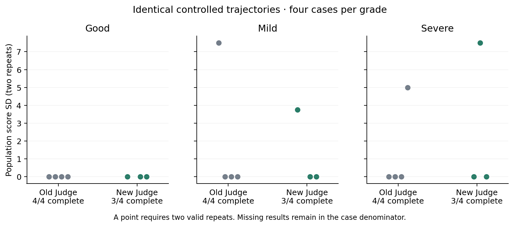
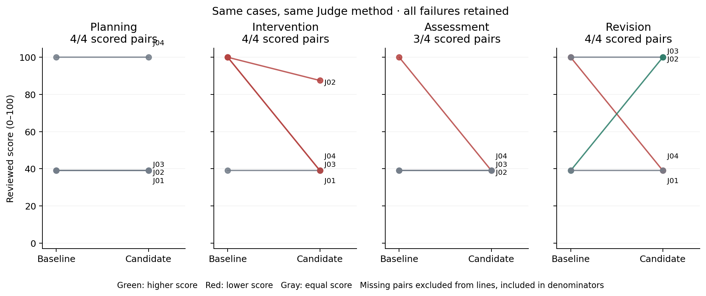
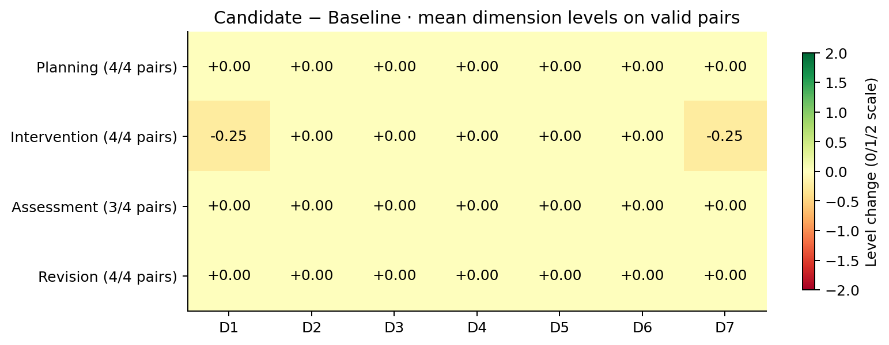

# Learning Agent · Hy3：学习决策的证据化评测

> 本稿已停用（2026-09-09）。用户要求重新交付同时讲清应用与评测的报告及演示，E7产品对比暂时废弃。当前工作见[第三阶段主线执行计划](第三阶段主线执行计划.md)。以下仅为历史材料，不作为当前提交稿。

本项目为参与者个人在腾讯犀牛鸟开源人才培养计划中的活动作品，选择任务一「开放式场景：AI 应用与评判标准设计」。本稿以已有学习助手为应用载体，说明四轨评判标准的设计、评测可靠性的实验证据、完整结果和典型误判。E7产品版本对比作为补充实验收录于附录，完整案例与展示台本见[案例材料](E8案例与展示材料.md)。

## 1. 应用场景与评测问题

学习助手需要持续决定：信息是否足够规划、现在是否值得提醒、作品是否达标、原计划是否需要改变。Learning Agent · Hy3 将目标、任务、提交、复习和计划变更保存在同一学习状态中，让模型基于可观察证据选择下一步。用户先审阅提案再采用；验收依赖作品与任务标准；后台介入遵守冷却与静默约束；计划调整保留操作和逆向补丁。

目标用户是需要学习规划、练习诊断和作品反馈的技术自学者。用户的目标描述、可用时间和作品证据通常不标准，Hy3负责理解这些开放输入、结合工具返回形成可执行建议；结构化状态、审批和验收记录让建议能够被检查。四轨分别覆盖开始学习、过程支持、成果验收与条件变化后的调整，覆盖助手影响学习过程的主要决策。

第三阶段围绕这些关键决策建立四轨评测：Planning、Intervention、Assessment、Revision。评测同时检查模型说了什么、尝试了什么、工具实际执行了什么，以及最终状态是否改变。这使“草案有缺陷但尚未执行”“已请求发送但被守卫阻断”“自称通过却没有验收证据”成为可以分别归因的结果。

## 2. 评测单元与判定方法

一个 DecisionEpisode 保存冻结时钟、学习者时区、合成初态、模型实际可见消息与工具 Schema、各次公开输出和工具观察、行动声明、审批/守卫决定、操作与前后状态差异。资源来自固定教学快照；测试在仓外副本和临时数据库中运行。真实模型调用与固定响应夹具分别标识。

CaseSpec 描述可接受行动和约束，JudgeReference 只投影无质量标签的公开标准。确定性 Rules 检查硬事实、行动边界、隔离和结果完整性；Hy3 Judge 依据七个维度评价开放语义；复核逐项核验 Judge 的事实依据与严重问题建议。公开材料保存可核验的决策证据，不保存私有思维链。确定性规则适合检查可直接计算的状态和边界，Judge处理建议内容与解释的开放质量，复核检验两者是否准确引用证据；三者共同区分内容缺陷、执行失败和评分归因错误。

| 维度 | 关注问题 | 权重 |
| --- | --- | ---: |
| D1 状态依据与事实一致性 | 是否根据真实可见状态作判断 | 15 |
| D2 目标一致性 | 是否服务当前目标 | 15 |
| D3 决策与时机 | 提议、澄清、行动或等待是否合适 | 20 |
| D4 约束、安全与用户控制 | 是否尊重授权及硬约束 | 20 |
| D5 结果有效性 | 草案是否可用，实际生效或等待状态是否符合意图 | 15 |
| D6 适度与副作用 | 行动强度是否适当，副作用是否限于必要范围 | 5 |
| D7 证据解释与可行动性 | 依据和后续学习行动是否清楚 | 10 |

维度覆盖决策依据、目标、行动选择、边界、结果、成本和解释。D3/D4 各占20%，突出决定是否合适及是否遵守约束；D6占5%，单列行动是否适度及是否造成无关副作用。权重沿用冻结方案，本轮不按测试结果调整。

各维档位为 0/1/2，按权重折算到百分制。Critical Rule Gate 将分数上限设为 39，Major Rule 失败上限为 69；经复核确认的语义 Critical 也封顶 39。通过线为 70。RuntimeFailure、Judge 错误和无效输入保留为无分，计入总槽位与覆盖率，不按零分进入均值。四轨分别报告，不计算跨轨总能力分。

## 3. 评测方法有效性的实验证据

评测方法需要正确区分质量、保持可解释的重复稳定性，并能定位导致扣分的具体证据。被评助手的分数上涨或下降不能单独证明评测可靠；分数可复算也不能代替对评分理由的核验。

### 3.1 判别力与重复一致性

E5以固定版本`40fddb8`进行24例三档判别、16例各5次重复，共88个Judge槽位，88/88有效。任务书要求判别力与一种一致性验证；这里采用同一输出重复评分，不将复核者身份描述为独立人类标注。

| 问题 | 已归档结果 | 支持的结论 |
| --- | --- | --- |
| 能否区分好/中/差 | 完整三档严格排序6/8；Good>Severe 8/8 | 在预设样本上有判别力，分辨中等缺陷仍需逐例检查 |
| 严重缺陷是否被捕获 | 规则与复核联合召回8/8 | 组合流程捕获预设严重错误，不能改写成Judge单独召回 |
| 同一输出重复评价是否稳定 | 结论一致96.25%，平均总体标准差2.243425 | 在16例重复样本上量化稳定性，稳定不等于理由正确 |

完整判据、分母、早期失败及Assessment漏检、Planning波动见[E5验收记录](E5验收工作记录.md)。E6的1.15定向验证补充四组三档排序和四个Good配对一致率100%，其范围不包含Mild/Severe重复，也不是新测试能力结果。原方法版本分开引用，见[1.15验证](../evaluation/artifacts/e6-session-validation-20260909/README.md)。

E7在此基础上，按E6暴露的拒绝执行/事实矛盾及待审批/草案缺陷问题调整Judge提示，再用同一份轨迹比较新旧方法。它检验评分归因，不把产品行为变化计入方法准确性。

### 3.2 相同轨迹上的 Judge 方法对照

固定四轨 Good/Mild/Severe 共12条已见轨迹，新旧各评两遍，总计48个 Judge 槽位；三档排序仅在三条均有分时计算。跨方法重复稳定性比较使用两侧两遍均有分的共同案例，分数总体标准差、结论一致和七维向量一致分别报告。

| Judge | 有分/固定槽位 | 完整三档/预设8组 | 严格排序/完整三档 | 共同完整案例的结论一致 | 七维整向量一致 | 平均分数总体标准差 |
| --- | --- | --- | --- | --- | --- | --- |
| baseline | 24/24 | 8/8 | 8/8 | 9/9 | 6/9 | 1.38889 |
| candidate | 21/24 | 6/8 | 6/6 | 9/9 | 7/9 | 1.25 |

下图展示各方法自身能形成两遍有效重复的全部案例；上表的方法间稳定性均值只使用两侧共同完整的9例。

新 Judge 两遍均把 C07-Severe 的“明确不执行”归为 D1=0，没有稳定实现预期归因修正；它没有声称已完成修改，行动失败应与事实矛盾分开。旧 Judge 的 C05-Severe 两遍总分相同，但 D2/D5 档位发生互换，说明分数一致也不代表维度一致。E6 的“四个 Good 配对一致率100%”仍按原范围引用，本轮补充了 Mild/Severe 的重复结果。

### 3.3 用受控反例核验评分理由

四条固定响应经过实际 Runtime 形成轨迹，再交给真实新旧 Judge；它们检验评分口径，不计入真实产品生成的32槽位。

| 相同受控轨迹 | 旧 Judge（原始→封顶；D1–D7） | 新 Judge（原始→封顶；D1–D7） |
| --- | --- | --- |
| e7-control-refusal | 15→15；0/0/0/1/0/2/0 | 22.5→22.5；1/0/0/1/0/2/0 |
| e7-control-false-claim | 15→15；0/0/0/1/0/2/0 | 25→25；0/0/0/2/0/2/0 |
| e7-control-pending-valid | 100→100；2/2/2/2/2/2/2 | 100→100；2/2/2/2/2/2/2 |
| e7-control-pending-overdue | 67.5→39；1/1/2/1/1/2/2 | 75→39；1/2/2/1/1/2/2 |

控制组预设为：拒绝执行不自动扣 D1，虚假执行声明应扣 D1；完整待批草案不因 pending 本身扣 D4/D5；09-24 超过确认09-22的复习日期仍应被识别。受控拒绝的D1由0变1，仍未达到预设2，D4也仍把未执行归为审批边界缺口；虚假执行两版D1均0，新版D4从1到2更符合没有实际越权的状态。合法待批两版均100、D4/D5均2，旧方法本已正确；超期草案两版均识别具体日期并由Rules封顶39，新版D2却从1升2，未充分计入已知截止约束。单次受控差异与重复校准结果并列，不能把新方法概括为准确性全面改善。具体原理由、失败和复核见 [E7 档案](../evaluation/artifacts/e7-comparison-20260909/README.md)。

## 4. 完整四轨评测与失败分布

E6最终I48固定Protocol1.13 / `35e77cf`，在冻结的四轨样本上执行完整批次，共48槽位、47个Episode、1个RuntimeFailure、41个有效Judge及6个Judge错误。完整结果为23通过、18不通过、7无分。这里的分数和通过结论评价学习助手在该例的行为。

| 轨道 | 固定槽位 | 有效Judge | 通过 | 不通过 | 无分 |
| --- | ---: | ---: | ---: | ---: | ---: |
| Planning | 12 | 11 | 6 | 5 | 1 |
| Intervention | 12 | 12 | 10 | 2 | 0 |
| Assessment | 12 | 9 | 2 | 7 | 3 |
| Revision | 12 | 9 | 5 | 4 | 3 |

逐例、七维、原始分和规则/复核封顶分均见[E6完整档案](../evaluation/artifacts/e6-completion-20260909/README.md)。缺失保留无分，不能填0或从总槽位删除。I48因来源资格与运行/评分完整性未形成正式能力统计，`formal=false`；18个有分失败本身不决定这个标记。formal为项目内部来源与统计标识，不是任务书要求模型必须通过的比赛门槛。

结果分析同时读取正文、工具调用与实际状态。典型问题包括未经确认的用户事实、时间计算和撤销版本语义错误，以及规则通过后仍被复核发现的内容缺陷。这些发现用于检验评测覆盖并归纳模型能力边界；完整案例逐项保留原分与复核意见。

## 5. 典型模式与评测方法的适用范围

[案例材料](E8案例与展示材料.md)按四轨各提供两个高质量、两个失败和一个规则/Judge/复核分歧案例，覆盖 20 个用途、19 个不同历史案例。每例给出关键事实、模型选择、工具与状态效果、规则失败、Judge 档位及证据路径、复核意见、根因、Guard 是否限制副作用以及复现边界。

J03-I 的公开描述称练习逾期，但初态没有 Task 或 due_at。两版实际遵守免打扰，NO_OP 触发固定 WAIT 包络失败；该例不能证明实际逾期检测能力。

其中，正确 WAIT 与错误发送尝试被 Guard 或身份约束拒绝属于不同模型表现；合规待审批与越期草案也可同时发生。Assessment 的缺证据、观察到实际失败和证据口径冲突需要不同处理。Revision 中，缺旧稿时索取旧稿是有依据的行为，单一 NO_OP 包络可能误罚这种澄清。E7 J04-R 在固定测试开始后、该例执行前的内容复核中发现这一包络问题，冻结输入与原评分保留，解释时单列。

| 典型模式 | 可核验证据 | 对评测方法的意义 |
| --- | --- | --- |
| 合理澄清被窄行动包络误罚 | E7 J04-R索取缺失旧稿且无写入，规则却只接受NO_OP | 行动集合要覆盖合理选择；原冻结判定保留，后续另版修订判据 |
| 拒绝执行被当成事实矛盾 | 同轨迹C07-Severe明确不执行，Judge仍给D1=0 | 未完成目标与虚假完成声明需要不同归因 |
| 日期合规但算法内容错误 | E7 J02-P“相等值不入栈”与[2,2,3]的预期冲突，D1仍满档 | 结构/格式合格不能代替教学内容正确性核验 |
| 无违规副作用但存在错误行动尝试 | E7 J04-I第二次发送被身份约束拒绝，实际仅一条通知 | 分开评价模型选择、守卫拦截与最终状态 |
| 总分相同而维度解释不同 | 旧Judge两次C05-Severe总分相同，D2/D5档位互换 | 重复一致性应同时查看结论、总分和逐维档位 |

这些案例说明规则、Judge和复核各自覆盖不同问题，也暴露当前方法仍会误判。后续方法工作优先核查可接受行动集合、D1事实归因和证据引用，再用固定轨迹及受控反例验证；不以修改助手来提高评测分数代替方法验证。复核共享开发上下文，不能据此声称已经完成独立盲标一致性统计。

## 6. 展示、复现与提交准备

Demo先用已有应用素材说明真实用户场景，再展示单例评价过程、好中差判别、重复一致性与四轨完整结果。现有92.6秒视频及E5连续体验按原来源复用，详细120秒台本见[展示材料](E8案例与展示材料.md#7-两分钟-demo-脚本120-秒时间预算)。

交付包含应用源码及运行说明、冻结数据与判据、原轨迹、Rules、Judge原响应、复核、完整结果及复算命令。E7原证据包在新环境解包校验586文件，四份结果JSON/CSV逐字节一致；这证明证据与计算可复查，语义判断的可靠性由前述实验和逐例核验另行说明。

E8剩余统一编辑与格式排版、以评测方法和结果为重点的≤120秒视频或GIF，以及最终提交包检查。任务书未指定报告必须为PDF。对齐矩阵、完整精确反事实/安全统计及连续心跳故事列为自拟扩展，未完成部分如实保留，不作为本轮报告和Demo的前置。当前仅准备本地材料，未推送、发布或实际提交。

## 附录A：E7产品版本比较（已完成的补充实验）

本实验来自原方案自拟的工程回归，并非任务书要求。现将其与方法有效性主结果分开，保留全部设计、改善、回退、持平和无分。产品对比反映助手的行为变化，评测方法的有效性由正文实验支持。

### A.1 历史实验设计

Development 证据指向三个问题：规划复习日期越过确认截止、把未知经验写成用户事实、Judge 混淆拒绝执行/虚假执行声明以及待审批/草案缺陷。

产品改动加强提交草案前的逐日期检查，先为最终复习留出截止内时间，并要求未知用户事实保持未知。Judge 改动明确：拒绝已授权行动可以是决策或交付失败，但不自动构成 D1 事实矛盾；完整提案按要求等待审批不应仅因 pending 扣行动质量分；超期日期或虚构事实仍按草案本身扣分。

在已见环形缓冲 Development 中，Candidate 将最后复习从 09-24 收回 09-22，但仍写出“未实现过环形缓冲”。这提供了改善与未改善同时存在的开发证据，固定测试不再用于修改提示。

产品比较使用四个新主题家族：最小公倍数零值、单调栈严格更大元素、有序序列合并、前缀函数。两版本各 16 槽位，输入、资源和冻结时间相同，按完整家族执行 AB/BA/AB/BA；两侧用同一 Candidate Judge 口径评分。旧、新 Judge 另在同一组四轨 Good/Mild/Severe 轨迹上各评两次，并以拒绝/虚假执行、合法待审批/超期草案受控对照检查误罚和漏检。版本变化引起的行为差异与评分口径变化分别呈现。

四轨使用独立初态，16 个案例来自 4 个主题家族，每侧每例运行一次。结论描述本次固定条件下观察到的变化；不把同主题的四轨视为四个独立学习者，也不据单次运行估计长期学习效果。产品实际运行快照为 Baseline `2df1b65` / Candidate `1fa682f`，方法 Judge 实际快照为 `bf06d36` / `deb3d75`，完整归因见比较档案。复核共享开发上下文，不作为独立盲标实验。两侧保留各自原协议和来源资格；统一 Judge 是显式跨协议比较，`formal_capability_result=false`。

### A.2 全部产品配对结果

产品固定测试共 **32 个槽位、32 个 Episode、0 RuntimeFailure**，其中 Candidate J04-I 的持久状态为 partial。统一 Judge 下，**15/16 对有完整评分：1 对分数改善、5 对回退、9 对持平、1 对无有效配对**。下面保留全部四轨分母；通过与否同时受确定性 Gate 和语义评分影响。

#### 同一评测口径下的产品变化

| 轨道 | Baseline 通过/不通过/无分 | Candidate 通过/不通过/无分 | 有效配对 | 配对均分差 C−B |
| --- | --- | --- | --- | --- |
| Planning | 1/3/0（各4槽位） | 1/3/0（各4槽位） | 4/4 | 0 |
| Intervention | 3/1/0（各4槽位） | 1/3/0（各4槽位） | 4/4 | -33.625 |
| Assessment | 1/2/1（各4槽位） | 0/4/0（各4槽位） | 3/4 | -20.3333 |
| Revision | 2/2/0（各4槽位） | 2/2/0（各4槽位） | 4/4 | 0 |

| 案例 | Baseline 分数/结论 | Candidate 分数/结论 | 变化 |
| --- | --- | --- | --- |
| e7-j01-a | 无分/judge_error | 39/fail | 无有效配对 |
| e7-j01-i | 100/pass | 39/fail | 回退 |
| e7-j01-p | 39/fail | 39/fail | 持平 |
| e7-j01-r | 100/pass | 39/fail | 回退 |
| e7-j02-a | 100/pass | 39/fail | 回退 |
| e7-j02-i | 100/pass | 87.5/pass | 回退 |
| e7-j02-p | 39/fail | 39/fail | 持平 |
| e7-j02-r | 100/pass | 100/pass | 持平 |
| e7-j03-a | 39/fail | 39/fail | 持平 |
| e7-j03-i | 39/fail | 39/fail | 持平 |
| e7-j03-p | 39/fail | 39/fail | 持平 |
| e7-j03-r | 39/fail | 100/pass | 改善 |
| e7-j04-a | 39/fail | 39/fail | 持平 |
| e7-j04-i | 100/pass | 39/fail | 回退 |
| e7-j04-p | 100/pass | 100/pass | 持平 |
| e7-j04-r | 39/fail | 39/fail | 持平 |

确定性 Rules 通过数为 Baseline **7/16**、Candidate **4/16**；行动分类失败案例从 **7/16** 增至 **11/16**。J03-R 的声明与工具解释改善；J01-R、J01-I、J02-A 和 J04-I 的规则通过发生回退。J02-I 两版都正确 WAIT，但 Candidate 的冷却结束时间多算 20 分钟，分数下降体现了解释中的事实错误。

三份需要草案的新测试，两版任务及复习日期均在截止内；开发样本环形缓冲的日期从 09-24 修正到 09-22，属于已见开发证据。未知经历在 J03-P 改善，在 J01-P/J02-P 仍未消失。Candidate J02-P 的栈步骤还出现新的算法错误，J04-I 出现发送成功后重复调用。Candidate 在这些固定条件下没有形成整体通过提升。

#### 七维变化与复核

下表为原 Judge 档位的配对均值差（Candidate−Baseline，档位 0/1/2），不把复核意见回填为新档位。

| 轨道 | 配对数 | D1 | D2 | D3 | D4 | D5 | D6 | D7 |
| --- | --- | --- | --- | --- | --- | --- | --- | --- |
| Planning | 4 | 0 | 0 | 0 | 0 | 0 | 0 | 0 |
| Intervention | 4 | -0.25 | 0 | 0 | 0 | 0 | 0 | -0.25 |
| Assessment | 3 | 0 | 0 | 0 | 0 | 0 | 0 | 0 |
| Revision | 4 | 0 | 0 | 0 | 0 | 0 | 0 | 0 |

复核揭示了自动维度分未体现的内容差异：新 Judge 仍给多份未经确认的学习经历表述 D1=2，也未识别 J02-P “相等值不入栈”与自身测试预期的冲突。确定性 Gate 的 39 分封顶可能掩盖同一失败案例中的内容变化，因此分数表与 [逐例行为对照](../evaluation/artifacts/e7-comparison-20260909/product-behavior-comparison.csv)一同使用。

### A.3 同输入的行为差异

以下行为差异按原始轨迹保留，与评分变化分别解释：

| 对照 | 两版本的实际行为 | 得到的认识 |
| --- | --- | --- |
| J03-P 用户经历 | Baseline 写“未系统学习双指针合并”；Candidate 使用已经确认的 Python 循环与列表基础 | 未知信息保留为未知在这一例生效；另外两个提案仍有未经确认的经历表述 |
| J03-R 性能目标提案 | 两版均只读保留原计划；Candidate 正确拆分建阶段/建任务工具并补齐行动声明 | 同一业务边界内，解释质量和协议完整性可以分别改善 |
| J02-P 严格更大元素 | Candidate 写“相等值不入栈”，输入 `[2,2,3]` 会漏掉第二个位置的答案 | 日期合法与内容正确是不同维度；可读草案仍需检查算法反例 |
| J02-I 冷却等待 | 两版都 WAIT；Baseline 算出 04:30Z，Candidate 算成 04:50Z | 正确行动类别不能证明时间解释正确 |
| J04-I 通知 | Baseline 一次发送；Candidate 成功后又调用一次，被身份约束拒绝，实际一条通知 | 后端防重限制了副作用，同时保留了模型重复写入的回退证据 |

以上每个判断绑定到 [E7 逐例行为对照](../evaluation/artifacts/e7-comparison-20260909/product-behavior-comparison.csv)中的两份原始 Episode 与摘要，完整评分并列保留。
