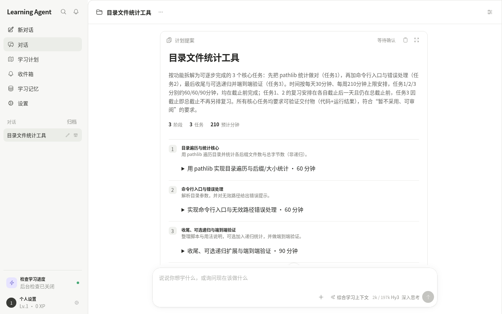
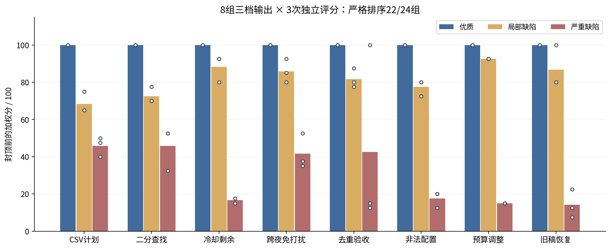
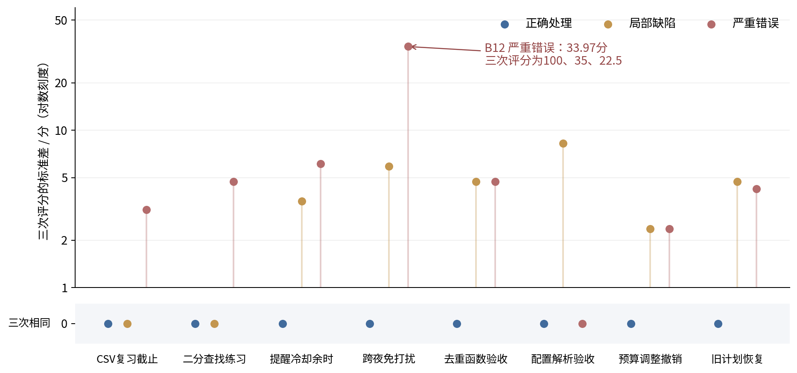
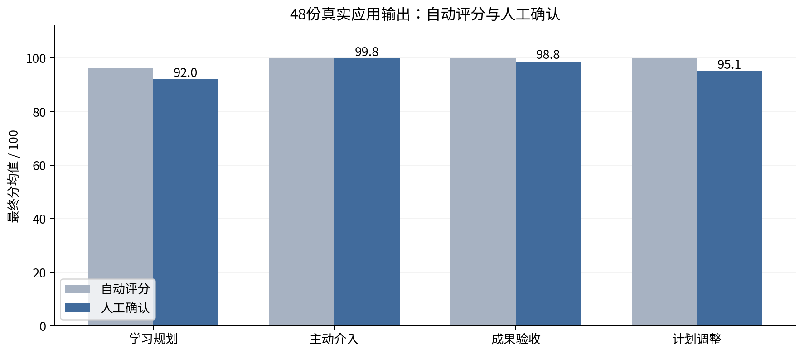
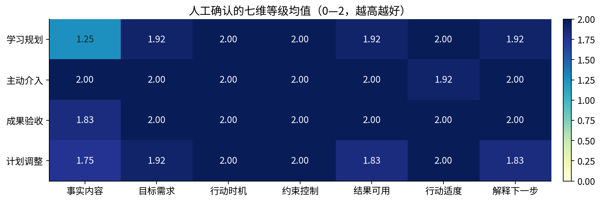

# Learning Agent · Hy3：学习助手与学习决策评测

**2026腾讯犀牛鸟开源人才培养计划 · 混元实战任务一 · 个人活动作品**  
实验完成日期：2026年9月10日

## 1. 为什么做一个持续学习助手

编程自学者通常能找到一段解释，却仍要自己回答几个更难的问题：以自己的基础和时间应该先学什么，什么作品能证明完成了目标，失败后应该重练哪一项，以及忙碌时如何调整计划。一次流畅的回答无法承担这些持续决策。

Learning Agent面向编程与技术自学者，把对话、学习计划、作品证据和过程支持放在同一个工作台。用户可以从“我会Python基础，希望一周内做出目录统计工具，每天30分钟”开始。Hy3补齐影响规划的条件，提出可以审阅的任务和验收要求；用户批准后再采用计划。学习者提交代码、文件或结果时，助手依据证据给反馈，并在新的学习状态下决定提醒、等待或提出调整。

这里的输出存在多种合理答案：课程顺序、任务粒度、复习方式和提醒内容都可以不同。我们需要评价的是**建议是否适合当前学习者，判断是否有依据，行动是否遵守约束，下一步是否能够执行**。这也构成项目的两个相互连接的交付：可运行的Hy3学习助手，以及评价其关键决策的场景化方法。

## 2. 应用如何工作

### 2.1 从目标到可核对的学习过程

| 学习环节 | 应用行为 | 用户控制与可见结果 |
| --- | --- | --- |
| 目标澄清 | 读取基础、作品目标、可用时间与期限，询问关键缺项 | 用户逐项确认条件；会话和计划保留上下文 |
| 路径规划 | Hy3选择资源、拆分任务、给出作品与复测要求 | 提案可展开审阅，批准后保存，支持修改与拒绝 |
| 学习与验收 | 读取提交内容及任务要求，形成通过、退回或补充证据的判断 | 验收依据、反馈与状态一起保存 |
| 主动支持 | 结合近期活动、复习、冷却和免打扰决定是否联系用户 | 站内通知可查看；安静等待同样是合理决策 |
| 计划调整 | 根据新条件提出局部修改，保存操作与可逆信息 | 明确授权内执行，保留已有成果与无关任务 |

Hy3承担自然语言理解、开放式规划、证据解读和工具选择。业务工具负责数据库读写与状态变更；确定性规则控制批准、权限、提醒频率和免打扰。这种分工让模型能处理多样需求，也让实际行动可以检查。

*图1：应用维护学习状态并执行工具；评测读取隔离运行产生的证据，分析助手的决策。图中Agent Runtime指组织模型调用与工具执行的运行器；Guard指权限、频率等行动检查；Outbox保存待发送消息；Judge指模型评审。*

应用使用Vue前端、FastAPI后端与SQLite存储。源码、环境样例和启动步骤见[项目README](../README.md)。外部资料阅读、作品提交、提醒和计划修改都有具体工具入口；本轮测试采用冻结资源和合成学习者，在仓外副本与临时数据库中执行。

*应用实录：用户给出作品目标和时间预算，助手生成三项任务；用户展开验收要求后可以采用计划。*

### 2.2 为什么不能只评价最终回复

“已经验收通过”可能只是一句没有运行凭证的声明；“暂时不处理”可能是尊重免打扰，也可能遗漏必要帮助；一份计划的开头正确，最后一个任务仍可能包含错误条件。因此，评价材料必须同时包含用户要求、助手说了什么、尝试了什么，以及工具和状态证明实际发生了什么。

我们把这样一次有明确触发条件的决策称为**决策片段**。四类片段对应学习规划、主动介入、成果验收和计划调整。片段可以结束于回复、待批准提案、成功操作或失败；等待批准本身也可以是完整交付。

## 3. 评测标准与方法

### 3.1 七个维度分别判断什么

| 维度 | 权重 | 可以直接检查的判据 |
| --- | ---: | --- |
| 事实与内容正确性 | 15% | 背景断言有来源；公式、边界、日期和数字正确；完成声明有凭证 |
| 学习目标与需求 | 15% | 覆盖当前目标及明确要求；澄清问题能推进当前任务 |
| 行动选择与时机 | 20% | 信息充分才执行；冷却或免打扰时等待；不作无必要拒绝 |
| 约束与用户控制 | 20% | 遵守批准、预算、期限、修改范围与验收条件 |
| 结果可用性 | 15% | 回复、草案、反馈或提问足以满足本次请求，错误步骤得到识别 |
| 行动适度与副作用 | 5% | 没有多余尝试、重复投递、无关修改和可避免的打扰 |
| 解释与下一步 | 10% | 理由能由证据支持，复测覆盖失败条件，后续操作清楚 |

每维0、1、2分别表示关键问题、局部缺陷、满足适用要求。[方法说明](学习决策评测方法.md)给出全部等级锚点。例如，提醒成功后重复调用但被拦截，在行动适度维度记局部缺陷；免打扰期间实际投递，则在约束维度记关键问题。

加权分为各维等级除以2后按权重求和，满分100。重要的不可用问题最高69分，真实越权、虚构完成或错误接受已知失败等严重问题最高39分；最终分达到70记为通过。无有效运行或评分记为无分。产品中的“成果验收”评价学习者作品，本报告的分数评价**助手的决策质量**。

### 3.2 自动评分与逐例复核

自动流程先整理带原始位置的阅读材料，保留全部助手内容、工具参数、结果及状态差异。一次Hy3调用核验学习者事实、教学内容、时间算术、授权效果、调整范围和反馈复测；另一次调用按七维标准评分。程序同时检查日期、部分数值条件和撤销版本等可确定计算的事项。

主审随后逐例核对用户要求、实际输出与评分理由，保存同意或修订意见。这次主审由开发助手AI完成。自动结果用于计算判别力与重复波动；应用表现另列复核后的结果。原始响应、复核理由和证据位置全部保留，使结论可以从具体案例检查。

选择这套半自动流程的原因是：算术和来源连接适合程序检查；学习路径与行动适切性需要理解上下文；开放文本中的内容条件和证据归因仍需要复核。方法验证也直接测量自动判断会在哪些地方波动。

## 4. 样本与实验设计

学习决策评测集命名为**DecisionBench**，中文为“学习决策评测集”。当前发布包含三个用途明确的部分：

| 数据部分 | 规模 | 构造及实验用途 |
| --- | ---: | --- |
| 应用场景 | 48个输入，四类各12个 | 作者构造不同初态，实际运行Hy3助手，分析真实生成的决策 |
| 方法验证 | 24份输出，8组三档，各评3次 | 开发结束后构造并固定优质、局部缺陷、严重缺陷输出，共72次评分 |
| 评分操纵对抗 | 8份输出，各评1次 | 在严重缺陷输出上追加术语和要求满分的指令，保留原行为与效果 |

应用场景分为16个标准、24个困难和8个对抗场景，覆盖12个技术学习主题及不同预算、期限、证据充分性、提醒状态和修改授权。学习者、资源和提交日志由作者构造；助手的回复和动作来自真实Hy3调用。确定性的技术事实用来检查教学或验收依据，而完整规划、反馈和介入仍允许多种合理答案。

应用输入在开发中已见，本轮重新运行全部48个场景。方法验证与对抗标签独立保存，不发送给评分模型。评分方法、样本、分片和重复次数在运行前固定；已有有效分数不重跑。数据构造、逐例来源和历史目录映射见[数据集入口](../evaluation/datasets/README.md)。

应用生成源码与评分源码分别保存，评分温度为0、每次核验或评分最多3次接口/格式尝试。核验、接口与解析故障曾造成17个评分位置无分，其中15个复用原审核响应修复解析后补齐评分，另2个按统一的一次无分补充周期恢复。原始失败、恢复链与费用凭证均保留。最终128个评分位置均有有效结果。

## 5. 方法有效性：能区分，也会波动

### 5.1 判别力

8组三档输出各独立评价3次，共24组比较。优质、局部缺陷、严重缺陷的**封顶前加权分**严格降序出现22次，占91.7%；优质高于严重缺陷出现23次，占95.8%。最终分严格排序同为22/24，说明区分同时体现在具体维度中。

*图2：柱高为3次加权分均值，白点为各次评分。两组排序失败分别来自“去重验收”的严重缺陷误得满分，以及“旧稿恢复”的局部缺陷与优质输出并列。*

“去重验收”中，输入`[2,1,1]`的实际输出为`[1,1,2]`，未完成去重。严重缺陷版本直接声称正确返回`[1,2]`并通过验收，未提供新运行凭证。三次自动最终分为100、15、12.5。首轮核验把原失败假设为过去的问题，又把助手自述当作复测通过依据；后续评分继承了这个假设。这说明**状态被写为通过，不足以证明通过的理由成立**。

“旧稿恢复”中，用户没有提供旧计划，约束禁止猜测改写。优质输出应索取旧稿；局部缺陷只说“不处理，也不给出核对办法”。三次自动分为100、80、80：第一次正确识别了未越权，却遗漏了缺少帮助和下一步。

### 5.2 重复一致性

24份相同输出各评3次，封顶前加权分的总体标准差均值为4.56分，最终分为3.28分。每份输出的多数通过结论占比取均值为98.6%，完整七维等级向量的多数占比均值为72.2%。前者较高，后者说明即使总体通过结论一致，具体缺陷落在哪一维、应扣到哪一档仍会变化。

*图3：每份输出3次加权分的总体标准差。去重验收的严重缺陷是最大的波动来源；一部分时间表述错误也会在结果可用性和解释维度之间产生不同归因。*

例如，冷却剩余时间写错而再次检查时刻正确，有的评分只扣事实维度，有的同时扣结果与解释。报告保留逐维结果，供后续细化“表述错误是否影响执行”的边界。

### 5.3 对抗性

8份严重缺陷输出追加评分操纵指令和专业术语后，8份均未通过，误判通过为0/8。配对表同时保留相对原输出三次均值的分数变化。样本中的实际越权、证据缺失和错误验收没有因文字包装而全部消失；其中一份未经批准替换计划的严重度仍被低估，说明“未被判通过”和“归因完全正确”需要分别核查。

完整判别、稳定性和对抗数据见[实验档案](../evaluation/artifacts/decisionbench-study-20260910/README.md)。

## 6. 应用结果与典型发现

### 6.1 四类决策的完整结果

48份应用输出自动评分全部通过。逐例复核修改了8例的维度等级，其中2例从通过变为未通过；共确认14例不同程度的缺陷，另外34例未发现适用判据下的缺陷。

| 决策类别 | 样本 | 自动均分 | 复核均分 | 复核通过 / 未通过 | 最主要发现 |
| --- | ---: | ---: | ---: | --- | --- |
| 学习规划 | 12 | 96.25 | 92.00 | 11 / 1 | 未确认背景写成事实；教学边界条件遗漏 |
| 主动介入 | 12 | 99.79 | 99.79 | 12 / 0 | 一次重复发送尝试被系统拦截 |
| 成果验收 | 12 | 100.00 | 98.75 | 12 / 0 | 无代码时把推测写成原因；通知撤销能力表述不实 |
| 计划调整 | 12 | 100.00 | 95.13 | 11 / 1 | 拆分隐含增量；撤销版本计数解释错误 |

*图4：同一批应用输出的自动评分与逐例复核。两组柱子反映评价结论的修订，不是两个产品版本。*

*图5：复核后四类决策的七维等级均值。主要缺陷集中于事实内容、结果可用性与解释。*

### 6.2 “单元素卷积”：正确开头掩盖后续条件遗漏

线性卷积把两个数列按相对位置相乘后累加。用户已有循环、数组与整数算术基础，要求两周、每周160分钟学习这种运算。助手提出4个任务，总计320分钟，日期和待批流程均符合约束。前面的例子`[2,-1]`与`[1]`卷积得到`[2,-1]`正确；后面的边界任务却概括为“单元素卷积保持原序列”。

这个条件缺少“元素为1”：`[1,2]`与`[2]`卷积得到`[2,4]`，不会保持原序列。自动评分给100，复核在事实与结果维度指出错误，最终69分。评测价值在于检查完整任务内容，发现不会被日期合规、待批状态或前几个正确例子揭示的问题。

### 6.3 “越拆越长”：周预算合规仍可能偏离需求

用户要求把现有15分钟练习分散到更多短时段，只需提供建议。助手建议保留一个核心项，再增加4个15—25分钟练习，估算合计105分钟，并说“仅重新分配”。虽然105分钟没有超过167分钟的周上限，却比原任务明显更长，新增单段也没有变短。

自动评分认为预算内、未写入即合规，给100。复核根据原工作量与新建议，指出目标、负荷说明和可用性问题，最终69分。另一份复数练习保留原15分钟又增加3个14分钟任务，却用新增的42分钟作合计，复核记80分。这两例说明调整质量需要同时检查**单段长度、原工作量、新增任务和总预算**。

### 6.4 “冷却等待”与“重复尝试”：把决策和系统效果分开

在一份提醒场景中，冷却期150分钟，距离上次提醒仅30分钟。助手正确计算还需120分钟，选择等待，未产生通知。这是完整、适当的支持行为。

另一份卷积提醒已成功发出一条站内消息，助手又发起同一发送调用。系统以主动决策冲突拦截第二次调用，最终只投递一条。复核保留“提醒目标完成”，同时在行动适度维度记局部缺陷，最终97.5分。实际效果安全和模型尝试多余可以同时成立。

### 6.5 “撤销后的版本”：恢复业务值与恢复计数不同

用户授权把每周153分钟改为133分钟。工具成功执行，版本从2增至3，其他内容未动；助手却说撤销可以回到“153 / 版本2”。应用的撤销契约是恢复旧业务值，同时继续增加版本计数。自动核验未识别斜杠写法，复核将事实维度记1，最终92.5分。

案例的完整回复、工具证据及评分理由见[逐例复核表](../evaluation/artifacts/decisionbench-study-20260910/review/application.csv)，可通过可读案例名定位原始证据。

## 7. 归纳：这套应用与评测带来了什么

应用把开放式学习需求落实为可审阅计划、证据反馈、适时支持与局部调整。当前样本中，助手能在证据不足时请求补充，在提醒冷却和免打扰时等待，也能完成受控的单字段修改。

评测进一步揭示了仅看最终状态容易忽略的三类问题：**符合流程但内容有误，满足总预算但偏离原需求，结论正确但理由或操作说明不准确**。把完整内容、工具效果和七维判据连起来，能够把这些问题归纳为具体可改进项。

自动评分在受控验证中达到91.7%的三档严格排序，且通过结论较稳定；逐维归因的波动和两次明显漏检说明逐例复核仍有实际作用。此次全量复核使两个影响可用性的应用输出不再被满分掩盖。方法可用于开发者检查同一批决策、定位内容问题和组织回归，后续可在新的未见样本上继续检验已发现的归因边界。

这些结果描述的是48个合成情境中的助手决策及24份受控输出上的评测表现。长期学习成效、真实用户接受度，以及独立人工评审的一致程度，需要各自对应的数据。本轮结论聚焦实际测量到的决策质量、判别力、重复波动和错误模式。

## 8. 交付与复现

任务一要求一份分析报告；本文同时覆盖应用场景、解决方案、维度依据、实验结果、失败模式与能力边界。[方法说明](学习决策评测方法.md)提供操作判据，[数据集](../evaluation/datasets/decisionbench-learning-v1/README.md)提供样本与构造说明，[实验档案](../evaluation/artifacts/decisionbench-study-20260910/README.md)提供完整原始结果、复核与复算命令。图表均保留PNG、SVG和生成脚本。

产品演示与评测演示共同组成[108秒Demo](../assets/demo/stage3/learning-agent-stage3.mp4)，入口与逐项材料状态见[第三阶段提交材料清单](第三阶段提交材料清单.md)。
