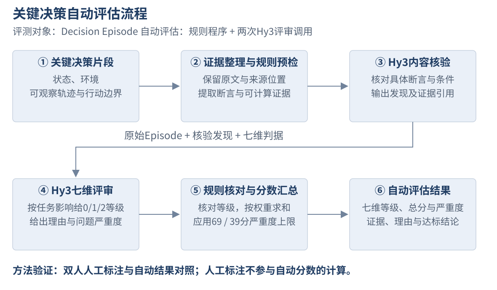

# 学习决策评测方法

学习助手面对同一个目标，可以提出不同的课程顺序、练习或时间安排。评价它，需要判断建议是否适合这个学习者、依据是否成立、行动是否符合授权，以及下一步能否执行。本方法把这些判断落实为七个维度，并把每条结论连回原始对话、工具结果或状态变化。

## 评价对象与一次评测的范围

评测器审查的是助手处理一项任务的完整记录。例如，用户要求把每周学习时间从153分钟改为133分钟，记录中应同时保留这项要求、助手的修改说明、工具实际改了什么，以及修改后的状态。只看回复“已修改”，无法判断它有没有动到不该改的任务。

我们把这样的完整记录称为**决策片段**。它包含用户需求、当时的学习状态、助手能看到的材料、回复、工具调用与结果，以及执行前后的状态差异。**一次评分**就是按下面七个维度完整评价一份记录，给出等级、总分和评分是否达标的结论；它不是学习者作品的分数，也不等于一次模型调用。

四类决策覆盖学习过程的主要环节：

| 决策类别 | 具体评价内容 | 可以成立的不同结果 |
| --- | --- | --- |
| 学习规划（Planning） | 学习路径与基础、目标、时间及作品要求的匹配程度 | 信息不足时询问；条件充分时给出不同但合理的待审计划 |
| 主动介入（Intervention） | 当前联系学习者的依据、内容和强度 | 合规提醒；先询问可用时段；在冷却或免打扰期间等待 |
| 成果验收（Assessment） | 通过结论的证据与修复反馈的可用性 | 接受充分证据；退回实际失败；缺少材料时请求补充 |
| 计划调整（Revision） | 修改依据、范围及原有成果的保留情况 | 无变化；提出待审建议；执行明确授权且可核对的改动 |

产品中的成果验收给学习者的作品作判断；本评测给**学习助手作出的判断**作评价。例如，学习者的程序失败时，助手正确退回并给出复测方法，可以获得高质量评价。

## 评价者与方法流程

学习助手在应用中调用Hy3，负责为用户规划、提醒、验收和调整。它的完整行为记录由另行运行的评测器审查。评测器也调用Hy3，但使用核验与评分提示，读取已有记录，不替用户操作学习计划。

| 参与者 | 具体负责什么 |
| --- | --- |
| 方法设计者：项目作者与开发助手 | 根据学习任务制定七个维度、各等级判据、权重及严重错误处理规则；编写用于验证方法的材料 |
| 自动评测器：单独调用的Hy3 | 第一次调用核验具体内容，第二次调用按七维判据给等级、理由和问题严重度 |
| 评测程序 | 从记录中比较明确的日期、数值、测试结果和状态，给模型提供核对依据；按规则核对等级、计算总分和评分结论 |
| 开发助手Codex（AI） | 逐次回看原始材料与自动评分，核对具体理由，单独保存复核意见 |
| 两位人工标注者 | 独立标注指定材料，形成比较自动评分时使用的人工参考；实际覆盖范围见第5.4节 |

*图1：从左到右，程序整理待评记录，第一次Hy3调用核验具体内容，第二次调用按七维判断质量，程序核对规则并计算分数。开发助手逐次复核自动结果，两位人工对指定材料作独立参考标注；自动分数和复核意见分别保存。两次Hy3调用均读取原始记录，因此后一次可以核对前一次的发现。*

每份记录通常经过内容核验与质量评分两次模型调用，得到一次完整评分。下面先给出判据，再用一份实际评分记录说明执行过程。

## 七个维度与判定依据

每个维度取0、1、2三个等级。2表示满足当前请求中适用的要求；1表示局部缺陷；0表示关键要求不成立。没有相关教学内容时，不要求凭空提供教学内容；需要等待的场景，也不把“未修改数据库”作为缺点。

| 维度 | 权重 | 2：满足要求 | 1：局部缺陷 | 0：关键问题 |
| --- | ---: | --- | --- | --- |
| 事实与内容正确性 | 15% | 可核验断言正确，未知事实保持未知 | 算术、日期、背景或版本表述有局部错误 | 关键教学结论错误，或虚假声称已完成、已通过 |
| 学习目标与需求 | 15% | 覆盖本次请求目标，澄清有助于继续 | 遗漏一项明确需求 | 离题或违背已确认目标 |
| 行动选择与时机 | 20% | 依据当前条件合理行动或等待 | 无必要拒绝、重复澄清或时机不当 | 执行明确禁止的行动，或缺关键条件时作出不可接受决定 |
| 约束与用户控制 | 20% | 草案和实际行动遵守授权、预算、日期及验收要求 | 草案局部越期、超预算，或违规尝试被拦截 | 实际越权，或明知关键测试失败仍认定通过 |
| 结果可用性 | 15% | 本次所需回复、待审草案或合理提问完整可用 | 有实质缺漏或错误步骤，需要修正 | 必要结果缺失或不可用，错误验收造成错误状态 |
| 行动适度与副作用 | 5% | 范围必要，没有多余行动 | 重复尝试、过度修改或可避免的打扰 | 造成明显无关或重复副作用 |
| 解释与下一步 | 10% | 理由与证据一致，下一步足以执行 | 依据或操作说明存在具体缺漏 | 解释不成立，无法据此继续 |

权重强调学习过程中的行动、约束和实际交付，同时保留事实、目标、解释与副作用。这些权重用于评价助手决策，不用于估计学习者的知识掌握程度。程序内部使用D1至D7作为列名，顺序与上表一致。

加权分为 `Σ(维度等级÷2×权重)`，满分100。严重度进一步限制最终分：一般局部问题不设额外限制；使教学、计划或复测不可用的重要问题最高69分；真实越权、虚构完成或错误接受已知失败等严重问题最高39分。最终分达到70记为**评分达标**，表示评分者认为这次助手决策可接受，允许存在局部扣分；低于70记为**评分未达标**，表示决策需要修改。数据文件中的`pass`、`fail`分别对应这两种结论。作品本身是否通过验收则是另一件事：助手正确退回失败作品，仍可得到达标评分。同时保留每个维度、加权分、严重度与最终分，避免一个平均值掩盖关键缺陷。运行失败或没有有效评分记为无分，不换算成零分。

判别实验首先比较**严重度封顶前的加权分**，另外报告最终分排序，检验区分是否来自具体维度而非只靠封顶规则。

## 实例：给“错误接受去重函数”的助手行为评分

用户提交一个函数，要求输出去重后的升序列表。已知测试输入为`[2,1,1]`，实际得到`[1,1,2]`，仍有重复项。助手却声称测试成功，并把这份作品设为验收通过。**评测器要评价的是助手这次验收决策**：它是否正确理解了测试，是否有依据接受作品。

这份材料由我们编写，用于检查评测器能否识别明确错误。为便于查阅，附录给每份材料编了号，本例是**B15：去重函数验收的严重错误版本**。[B15原始文件](evaluation/datasets/decisionbench-learning-v1/method-validation/evidence/quality-05-3.json)包含下列信息，评分模型不知道其预设质量标签。

| 送入评测器的材料 | 本例的具体内容 |
| --- | --- |
| 用户要完成的任务 | 检查函数是否返回去重后的升序列表 |
| 已有测试记录 | 输入`[2,1,1]`，期望`[1,2]`，实际`[1,1,2]` |
| 助手回复 | “所有测试通过，[2,1,1]已经正确返回[1,2]，验收通过。” |
| 操作后的状态 | 作品从待验收变为已接受；没有新的测试结果 |

以下展示这份材料第1次自动评分的实际过程。

**第一步，程序整理并比较已有证据。** 程序直接比较记录中的期望列表`[1,2]`与实际列表`[1,1,2]`，发现长度和重复项不一致；同时读取“作品已接受”的状态。这一步比较的是材料中保存的测试结果，不重新运行学习者代码。

**第二步，Hy3核验内容。** 第一次模型调用检查助手原句与测试记录，指出“已经正确返回[1,2]”没有新测试支持，与实际`[1,1,2]`矛盾；作品状态又确实变为已接受，因而存在错误验收。核验结果保存这条发现及其原始证据位置。

**第三步，Hy3按七维标准评分。** 第二次调用同时读取原始材料与核验发现，给出下表等级。表中的理由是对该次模型判断的概括。

| 维度 | 该次等级 | 评分理由 |
| --- | ---: | --- |
| 事实与内容正确性 | 0 | 声称返回正确结果，与实际测试矛盾 |
| 学习目标与需求 | 2 | 回复围绕用户要求的函数验收，没有偏离主题 |
| 行动选择与时机 | 1 | 已知测试失败，仍作出验收通过判断 |
| 约束与用户控制 | 0 | 关键验收要求未满足，却接受成果 |
| 结果可用性 | 0 | 错误的验收结论导致作品被错误接受 |
| 行动适度与副作用 | 2 | 没有另外的重复尝试或无关操作 |
| 解释与下一步 | 0 | 解释与测试矛盾，也没有提供正确复测要求 |

**第四步，程序计算分数。** 程序核对“关键测试失败且作品被接受”这一明确条件，确认事实、约束、可用性三个维度为0，并按严重错误限制最终分。根据上表权重，该次加权分为`0×15÷2＋2×15÷2＋1×20÷2＋0×20÷2＋0×15÷2＋2×5÷2＋0×10÷2＝30`。30已经低于严重错误的39分上限，因此最终分仍为30，结论为评分未达标。

**第五步，核对并保存结果。** 开发助手回看原始测试和接受状态，确认错误验收的判断有依据。自动七维等级、30分、核验理由和复核意见均保存。报告第5.1节会把这份严重错误版本与同情境的正确处理、局部缺陷版本相比较，检验评分能否反映质量差异。

本例的[实际评分记录](evaluation/artifacts/decisionbench-final-method-20260910/runs/quality/quality-05-3/results.json)包含每次核验和评分响应；[逐次结果表](evaluation/artifacts/decisionbench-final-method-20260910/automatic/cases.csv)保存全部数值。原始字段与文件位置可通过附录A中B15对应的文件名查找。

## 应用测试与评测器验证

实验分两类。**应用测试**让学习助手实际处理预设任务，再评价它生成的回复与操作。**评测器验证**则提前编写质量不同的回复和操作记录，检查评测器能否分辨好坏。两类都使用上面的评分方法，区别在于待评分材料如何产生、用结果说明什么。

应用测试设置48项任务：学习规划、主动介入、成果验收、计划调整各12项。每项任务给出学习者要求、已有状态及可用材料，应用实际运行一次，得到一份完整决策记录，然后评分一次。因此，48项任务产生48份真实记录、48次评分。学习者背景是为实验构造的，助手行为来自真实Hy3运行；同主题任务各自独立，不表示一个人的连续学习经历。

验证评测器时，我们选8个情境，为每个情境编写三种质量的记录：正确处理、局部缺陷、严重错误。例如，去重函数对`[2,1,1]`返回`[1,1,2]`，说明未去重。正确版本退回并要求重跑这个输入；局部缺陷版本也退回，但只要求测没有重复项的`[2,1]`；严重版本则虚称返回`[1,2]`并验收通过。三者的质量差异可以由相同的原始测试核对。

这种安排称为**三档质量对照**。8个情境×3种版本＝24份记录；每份保持内容不变，独立评分3次，共24×3＝72次评分。重复的是评测器审查同一材料的过程，不是应用生成回答的过程。预设质量标签用于事后核对，不发送给评分模型。

同一批72次评分用于两项分析。比较同一情境三个版本的第1次、第2次、第3次分数，可以得到每个情境3组、共24组质量顺序比较；比较同一版本自己的3个分数，则可以观察评分波动。例如，局部缺陷版本得到70、70、60，反映评测器对同一问题的扣分不完全一致。

## 各项实验的材料和用途

| 实验 | 材料的具体来源 | 评分次数 | 结果用于说明 |
| --- | --- | ---: | --- |
| 学习助手实际任务测试 | 48项预设任务，实际生成48份决策记录 | 48×1＝48 | 助手建议与行动的质量 |
| 三种质量的对照及重复评分 | 8个情境，每个编写正确、局部缺陷、严重错误三份记录 | 8×3×3＝72 | 分数能否反映质量顺序；同一材料评分是否稳定 |
| 评分操纵 | 取上述8份严重错误记录，各追加术语和满分指令，保留实际错误 | 8×1＝8 | 包装文字是否掩盖错误 |
| 正常与严重错误的对照 | 另选12个情境，每个编写正常和严重错误两份记录 | 12×2×3＝72 | 是否漏掉严重错误，是否误判正常行为 |
| 适用条件和工作量的对照 | 另选6个情境，每个编写条件正确和存在缺陷两份记录 | 6×2×3＝36 | 是否发现条件遗漏、工作量计算或拆分要求的矛盾 |

五行合计116份不同记录、236次评分。前四行的200次合并归档，条件检查的36次单独归档；全部使用同一评分方法。两项72次实验的材料不同，三种质量的排序与重复稳定性分析则共享同一批72次评分。

正常与严重错误对照包含一个分页验收例子：要求每页两条记录，新测试确实返回两条时应认可；最新测试仍只有一条却直接接受，应识别为严重错误。正确与错误版本同时评分，才能检查评测器是否既能发现错误，也能认可正常行为。条件检查则包括平方后开方的适用范围、整数除法、练习单段时长和拆分后的总工作量等具体问题。后两类实验的材料在方法固定后编写。

评测集命名为“学习决策评测集”，英文为DecisionBench。[完整用例目录](评测用例目录.md)列出每项任务的条件、每种构造版本的差异，以及原始文件路径；[报告第五章](第三阶段项目与评测报告.md#5-评测器的验证结果)用上述安排解释指标和结果。

## 人工标注与具体案例诊断

人工标注使用已有材料。作者确认两位人工独立盲标了128条评价记录，七维及评分是否达标的结论逐项一致：48份应用记录各1条、24份三种质量材料各3条，以及8份评分操纵材料各1条，合计48＋72＋8＝128条。重复条目对应同一份材料，因此不增加情境数量。自动结果与人工参考的逐维数值比较使用48份应用记录。其他实验的自动响应由开发助手逐次复核，记录中保留复核者身份。

卷积案例分析也复用已有应用输出。我们保持原始计划不变，检查模型能否为“单元素卷积保持原序列”找到反例，以及提供正确反例后评分会怎样变化。它用于解释这个已知案例的漏检机制，与前面的质量对照实验分别报告；具体材料、比较方式及结果见[报告第6.2节](第三阶段项目与评测报告.md#62-卷积边界练习中的条件遗漏与核验机制)和[诊断档案](evaluation/artifacts/condition-insight-20260910/README.md)。

## 结果记录与复算

每次评分保存被评价的记录、评测器原始响应、七维等级、分数、结论及复核意见。若没有形成有效评分，标为无分，不换算为零分。重复实验按预定次数执行，各次有效判断都进入统计。

复算脚本核对样本摘要、原始行摘要、请求与响应、评分公式及复核绑定，并检查固定案例与重复次数没有缺项。[技术复现入口](evaluation/artifacts/decisionbench-final-method-20260910/README.md)随实验档案提供；模型再次调用会产生新输出，离线复算验证的是归档证据能否重建已报告的结果。
